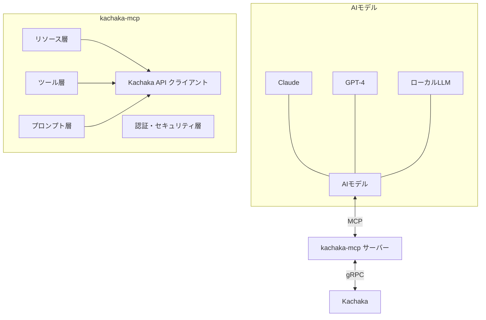

# Kachaka MCP サーバー

## 1. 概要

Kachaka MCPサーバー（kachaka-mcp）は、[Kachaka](https://kachaka.life/home/)の機能をModel Context Protocol（MCP）を通じて様々なAIモデルに提供するサーバーです。このサーバーにより、Claude、GPT-4、ローカルLLMなどのAIモデルがKachakaの状態を把握し、制御することができるようになります。

## 2. アーキテクチャ



## 3. 主要コンポーネント

### 3.1 Kachaka API クライアント
- Kachaka APIとの通信を担当
- KachakaApiClientを使用してKachaakaと通信
- 同期・非同期両方のインターフェースをサポート
- ネットワーク接続の管理と再接続機能

### 3.2 リソース層
Kachakaの状態情報をMCPリソースとして公開します：

#### 3.2.1 Kachaaka情報リソース
- `robot://status` - Kachaakaの現在の状態（位置、バッテリー、エラーなど）
- `robot://version` - Kachaakaのバージョン情報
- `robot://serial` - シリアル番号
- `robot://command` - 現在実行中のコマンド情報

#### 3.2.2 マップリソース
- `map://current` - 現在のマップ情報（PNG形式）
- `map://locations/{location_id?}` - 登録された場所の情報
- `map://shelves/{shelf_id?}` - 棚の情報と位置
- `map://list` - 利用可能なマップのリスト

#### 3.2.3 センサーリソース
- `sensors://camera/front` - 前面カメラ画像
- `sensors://camera/back` - 背面カメラ画像
- `sensors://camera/tof` - ToFカメラ画像
- `sensors://laser` - レーザースキャンデータ
- `sensors://imu` - IMUデータ
- `sensors://odometry` - オドメトリデータ
- `sensors://object_detection` - 物体検出結果

### 3.3 ツール層
Kachakaの操作機能をMCPツールとして公開します：

#### 3.3.1 移動ツール
- `move_to_location(location_name: str)` - 指定した場所に移動
- `move_to_pose(x: float, y: float, yaw: float)` - 指定した座標に移動
- `return_home()` - ホームに戻る
- `move_forward(distance_meter: float, speed: float)` - 指定した距離前進
- `rotate_in_place(angle_radian: float)` - その場で回転
- `set_robot_velocity(linear: float, angular: float)` - Kachaakaの速度を設定

#### 3.3.2 棚操作ツール
- `move_shelf(shelf_name: str, location_name: str)` - 棚を指定した場所に移動
- `return_shelf(shelf_name: str)` - 棚を元の場所に戻す
- `dock_shelf()` - 棚にドッキング
- `undock_shelf()` - 棚からアンドック
- `dock_any_shelf_with_registration(location_name: str, dock_forward: bool)` - 任意の棚にドッキングして登録

#### 3.3.3 システム操作ツール
- `speak(text: str)` - テキストを音声で発話
- `cancel_command()` - 実行中のコマンドをキャンセル
- `proceed()` - 次のステップに進む
- `lock(duration_sec: float)` - 指定した時間ロックする
- `set_auto_homing_enabled(enable: bool)` - 自動ホーミングの有効/無効を設定
- `set_manual_control_enabled(enable: bool)` - 手動制御の有効/無効を設定
- `set_speaker_volume(volume: int)` - スピーカーの音量を設定
- `restart_robot()` - Kachaakaを再起動

#### 3.3.4 マップ操作ツール
- `switch_map(map_id: str)` - マップを切り替える
- `export_map(map_id: str, output_file_path: str)` - マップをエクスポート
- `import_map(target_file_path: str)` - マップをインポート
- `set_robot_pose(pose: dict)` - Kachaakaの位置を設定

### 3.4 プロンプト層
AIモデルとの対話を効率化するためのプロンプトテンプレートを提供します：

- `robot_control_prompt()` - Kachaaka制御のための基本プロンプト
- `shelf_operation_prompt()` - 棚操作のための基本プロンプト
- `navigation_prompt()` - ナビゲーションのための基本プロンプト
- `error_handling_prompt()` - エラー処理のための基本プロンプト

### 3.5 認証・セキュリティ層
- APIキーベースの認証
- アクセス制御と権限管理
- 操作ログの記録

## 4. 実装計画

### 4.1 プロジェクト構造

```
kachaka-mcp/
├── README.md                # プロジェクト概要
├── pyproject.toml           # プロジェクト設定
├── requirements.txt         # 依存関係
├── src/
│   └── kachaka_mcp/
│       ├── __init__.py
│       ├── server.py        # MCPサーバーのメイン実装
│       ├── resources.py     # リソース定義
│       ├── tools.py         # ツール定義
│       ├── prompts.py       # プロンプト定義
│       ├── client.py        # Kachaka APIクライアントラッパー
│       ├── auth.py          # 認証・セキュリティ
│       └── utils/
│           ├── __init__.py
│           ├── config.py    # 設定管理
│           └── logging.py   # ロギング
├── scripts/
│   ├── install.sh           # インストールスクリプト
│   └── run.sh               # 実行スクリプト
└── tests/
    ├── __init__.py
    ├── test_server.py
    ├── test_resources.py
    └── test_tools.py
```

### 4.2 依存関係

```toml
[project]
name = "kachaka-mcp"
version = "0.1.0"
description = "MCP server for Kachaka robot"
requires-python = ">=3.10"
dependencies = [
    "mcp[cli]>=1.7.1",
    "kachaka-api@git+https://github.com/pf-robotics/kachaka-api",
    "grpcio",
    "pydantic",
    "pillow",
    "numpy",
    "loguru",
    "protobuf==5.27.2"
]

[project.optional-dependencies]
dev = [
    "pytest",
    "black",
    "isort",
    "mypy",
    "ruff",
]
```

### 4.3 サーバー実装

#### 4.3.1 メインサーバークラス

```python
# server.py
import asyncio
from contextlib import asynccontextmanager
from typing import AsyncIterator, Optional

from kachaka_api.aio import KachakaApiClient
from mcp.server.fastmcp import Context, FastMCP

from .resources import register_resources
from .tools import register_tools
from .prompts import register_prompts
from .auth import KachakaAuthProvider


class KachakaMCPContext:
    """Kachaka MCP サーバーのコンテキスト"""
    def __init__(self, kachaka_client: KachakaApiClient):
        self.kachaka_client = kachaka_client


@asynccontextmanager
async def kachaka_lifespan(server: FastMCP) -> AsyncIterator[KachakaMCPContext]:
    """Kachaka MCP サーバーのライフスパン管理"""
    # 設定の読み込み
    from .utils.config import load_config
    config = load_config()
    
    # Kachaka APIクライアントの初期化
    kachaka_client = KachakaApiClient(target=config.kachaka_host)
    
    try:
        # コンテキストの作成と提供
        context = KachakaMCPContext(kachaka_client)
        yield context
    finally:
        # クリーンアップ処理
        pass


def create_server(server_name: str = "Kachaka Robot") -> FastMCP:
    """Kachaka MCP サーバーを作成"""
    # MCPサーバーの作成
    mcp = FastMCP(
        server_name,
        lifespan=kachaka_lifespan,
        auth_provider=KachakaAuthProvider(),
    )
    
    # リソース、ツール、プロンプトの登録
    register_resources(mcp)
    register_tools(mcp)
    register_prompts(mcp)
    
    return mcp


def main():
    """メイン関数"""
    server = create_server()
    server.run()


if __name__ == "__main__":
    main()
```

#### 4.3.2 リソース実装例

```python
# resources.py
from mcp.server.fastmcp import FastMCP, Context, Image
from PIL import Image as PILImage
import io
import json

def register_resources(mcp: FastMCP):
    """リソースの登録"""
    
    @mcp.resource("robot://status")
    async def get_robot_status(ctx: Context) -> str:
        """Kachaakaの現在の状態を取得"""
        kachaka_client = ctx.request_context.lifespan_context.kachaka_client
        
        # 各種情報の取得
        pose = await kachaka_client.get_robot_pose()
        battery_info = await kachaka_client.get_battery_info()
        command_state, command = await kachaka_client.get_command_state()
        
        # JSONとして返す
        status = {
            "pose": {
                "x": pose.x,
                "y": pose.y,
                "yaw": pose.yaw
            },
            "battery": {
                "percentage": battery_info[0],
                "status": str(battery_info[1])
            },
            "command_state": str(command_state),
            "command": {
                "type": command.WhichOneof("command"),
                "id": command_state.command_id if command_state.command_id else ""
            }
        }
        
        return json.dumps(status, indent=2)
    
    @mcp.resource("map://current")
    async def get_current_map(ctx: Context) -> Image:
        """現在のマップ画像を取得"""
        kachaka_client = ctx.request_context.lifespan_context.kachaka_client
        
        # マップの取得
        map_data = await kachaka_client.get_png_map()
        
        # 画像として返す
        return Image(data=map_data.data, format="png")
    
    # 他のリソースも同様に実装...
```

#### 4.3.3 ツール実装例

```python
# tools.py
from mcp.server.fastmcp import FastMCP, Context
from typing import Dict, Any

def register_tools(mcp: FastMCP):
    """ツールの登録"""
    
    @mcp.tool()
    async def move_to_location(location_name: str, ctx: Context) -> str:
        """指定した場所にKachaakaを移動させる"""
        kachaka_client = ctx.request_context.lifespan_context.kachaka_client
        
        # 進捗報告の設定
        ctx.info(f"Moving to location: {location_name}")
        
        # 移動コマンドの実行
        result = await kachaka_client.move_to_location(
            location_name,
            wait_for_completion=True
        )
        
        # 結果の返却
        if result.success:
            return f"Successfully moved to {location_name}"
        else:
            return f"Failed to move to {location_name}: {result.message}"
    
    @mcp.tool()
    async def speak(text: str, ctx: Context) -> str:
        """テキストを音声で発話する"""
        kachaka_client = ctx.request_context.lifespan_context.kachaka_client
        
        # 発話コマンドの実行
        result = await kachaka_client.speak(text, wait_for_completion=True)
        
        # 結果の返却
        if result.success:
            return f"Successfully spoke: {text}"
        else:
            return f"Failed to speak: {result.message}"
    
    # 他のツールも同様に実装...
```

#### 4.3.4 プロンプト実装例

```python
# prompts.py
from mcp.server.fastmcp import FastMCP
from mcp.server.fastmcp.prompts import base

def register_prompts(mcp: FastMCP):
    """プロンプトの登録"""
    
    @mcp.prompt()
    def robot_control_prompt() -> list[base.Message]:
        """Kachaaka制御のための基本プロンプト"""
        return [
            base.SystemMessage(
                "あなたはKachakaを制御するアシスタントです。"
                "以下のツールを使ってKachaakaを操作できます："
                "- move_to_location: 指定した場所に移動"
                "- return_home: ホームに戻る"
                "- speak: テキストを音声で発話"
                "など"
            ),
            base.UserMessage("Kachakaを操作するのを手伝ってください。"),
        ]
    
    # 他のプロンプトも同様に実装...
```

### 4.4 設定管理

以降に出てくる`kachaka_host`や`KACHAKA_HOST`の値は「[PythonでカチャカAPIを利用する](https://github.com/pf-robotics/kachaka-api/blob/main/docs/PYTHON.md)」に記載されている`target=`に続く値と同じ値が入ります。  
なお`26400`は[Kachaka APIサーバー (gRPC)](https://github.com/pf-robotics/kachaka-api/blob/main/docs/PLAYGROUND.md#playground%E3%81%AE%E4%BB%95%E6%A7%98)のポート番号です。

```python
# utils/config.py
from pydantic import BaseModel
import os
import json
from pathlib import Path

class KachakaMCPConfig(BaseModel):
    """Kachaka MCP サーバーの設定"""
    kachaka_host: str = "192.168.1.100:26400"  # デフォルトのKachakaホスト
    server_name: str = "Kachaka Robot"
    log_level: str = "INFO"
    auth_enabled: bool = False
    api_keys: list[str] = []


def load_config() -> KachakaMCPConfig:
    """設定を読み込む"""
    # 環境変数から設定を読み込む
    config_path = os.environ.get("KACHAKA_MCP_CONFIG", "~/.kachaka-mcp/config.json")
    config_path = Path(config_path).expanduser()
    
    # デフォルト設定
    config = KachakaMCPConfig()
    
    # 設定ファイルが存在する場合は読み込む
    if config_path.exists():
        with open(config_path, "r") as f:
            config_data = json.load(f)
            config = KachakaMCPConfig(**config_data)
    
    # 環境変数で上書き
    if os.environ.get("KACHAKA_HOST"):
        config.kachaka_host = os.environ.get("KACHAKA_HOST")
    
    return config
```

### 4.5 認証実装

```python
# auth.py
from mcp.server.auth import OAuthServerProvider, ClientRegistrationOptions, RevocationOptions
from typing import Dict, List, Optional

class KachakaAuthProvider(OAuthServerProvider):
    """Kachaka MCP サーバーの認証プロバイダー"""
    
    def __init__(self):
        from .utils.config import load_config
        self.config = load_config()
        self.api_keys = set(self.config.api_keys)
    
    async def validate_client_credentials(self, client_id: str, client_secret: str) -> bool:
        """クライアント認証情報の検証"""
        if not self.config.auth_enabled:
            return True
        
        return client_secret in self.api_keys
    
    # 他の認証メソッドも実装...
```

## 5. デプロイメント

### 5.1 uv syncを使ったインストール（推奨）

[uv](https://docs.astral.sh/uv/)をインストールします。(まだインストールしていない場合)  
kachaka-mcpを以下の手順でインストールします。
```bash
git clone https://github.com/pf-robotics/kachaka-mcp.git
cd kachaka-mcp

# インストール
uv sync

# または開発用依存関係も含めてインストール
uv sync --all
```

### 5.2 Claude Desktopからの使用方法

`claude_desktop_config.json` に以下の記述を追加してください：
```json
{
  "mcpServers": {
    "kachaka-mcp": {
      "command": "uv",
      "args": [
        "--directory",
        "<path to kachaka-mcp directory>",
        "run",
        "python",
        "-m",
        "kachaka_mcp.server"
      ],
      "env": {
        "KACHAKA_HOST": "<kachaka robot host>"
      }
    }
  }
}
```
ここで、kachaka-mcpのディレクトリや`KACHAKA_HOST`の値は、お使いの環境に合わせて変更してください。

### 5.3 Linux/macOSでの実行

```bash
# インストール
bash scripts/install.sh

# 設定
export KACHAKA_HOST="192.168.1.100:26400"  # Kachakaのホスト

# 実行
bash scripts/run.sh

# 開発モードで実行（MCP Inspector付き）
bash scripts/run.sh --dev

# Claude Desktopにインストール
bash scripts/run.sh --install
```

### 5.2 Windows（バッチファイル）での実行

```batch
REM インストール
scripts\install.bat

REM 実行
scripts\run.bat --host 192.168.1.100:26400

REM 開発モードで実行
scripts\run.bat --dev --host 192.168.1.100:26400

REM Claude Desktopにインストール
scripts\run.bat --install --host 192.168.1.100:26400
```

### 5.4 Windows（PowerShell）での実行

```powershell
# インストール
.\scripts\Install-KachakaMCP.ps1

# 実行
.\scripts\Start-KachakaMCP.ps1 -Host "192.168.1.100:26400"

# 開発モードで実行
.\scripts\Start-KachakaMCP.ps1 -Dev -Host "192.168.1.100:26400"

# Claude Desktopにインストール
.\scripts\Start-KachakaMCP.ps1 -Install -Host "192.168.1.100:26400"
```

### 5.5 設定ファイルの使用

環境変数の代わりに設定ファイルを使用することもできます。設定ファイルは `~/.kachaka-mcp/config.json`（Linux/macOS）または `%USERPROFILE%\.kachaka-mcp\config.json`（Windows）に配置します。

```json
{
  "kachaka_host": "192.168.1.100:26400",
  "server_name": "My Kachaka Robot",
  "log_level": "INFO",
  "auth_enabled": false,
  "api_keys": []
}
```

設定ファイルの場所は環境変数 `KACHAKA_MCP_CONFIG` で変更できます：

```bash
# Linux/macOS
export KACHAKA_MCP_CONFIG="/path/to/config.json"

# Windows CMD
set KACHAKA_MCP_CONFIG=C:\path\to\config.json

# Windows PowerShell
$env:KACHAKA_MCP_CONFIG = "C:\path\to\config.json"
```

### 5.6 直接実行（すべてのプラットフォーム）

```bash
# インストール
pip install -e .

# 設定
export KACHAKA_HOST="192.168.1.100:26400"  # Kachakaのホスト（Linux/macOS）
# または
set KACHAKA_HOST=192.168.1.100:26400  # Kachakaのホスト（Windows CMD）
# または
$env:KACHAKA_HOST = "192.168.1.100:26400"  # Kachakaのホスト（Windows PowerShell）

# 実行
python -m kachaka_mcp.server

# または
mcp run kachaka_mcp.server

# 開発モードで実行（MCP Inspector付き）
mcp dev kachaka_mcp.server

# Claude Desktopにインストール
mcp install kachaka_mcp.server --name "Kachaka Robot" -v KACHAKA_HOST=192.168.1.100:26400
```

## 6. テスト計画

### 6.1 単体テスト
- リソース機能のテスト
- ツール機能のテスト
- 認証機能のテスト

### 6.2 統合テスト
- サーバー起動と終了のテスト
- AIモデルとの連携テスト
- エラー処理のテスト

### 6.3 エンドツーエンドテスト
- 実際のKachakaとの連携テスト
- 様々なAIモデルからのアクセステスト

## 7. 今後の拡張性

### 7.1 短期的な拡張計画
- WebUIの追加（サーバー状態の監視、設定変更など）
- 複数Kachaakaの管理機能
- カスタムコマンドのサポート

### 7.2 中長期的な拡張計画
- 高度なスケジューリング機能
- ユーザー定義のワークフロー
- 他のロボットプラットフォームとの連携

## 8. セキュリティ考慮事項

- ネットワークセキュリティ（TLS/SSL対応）
- アクセス制御と認証
- 安全な操作の確保（危険な操作の制限）
- ログ記録と監査

## 9. デバッグ

[MCP Inspector](https://github.com/modelcontextprotocol/inspector)を使う場合は以下のようにします。  

```bash
npx @modelcontextprotocol/inspector -e KACHAKA_HOST=192.168.1.100:26400 uv run python -m kachaka_mcp.server
```